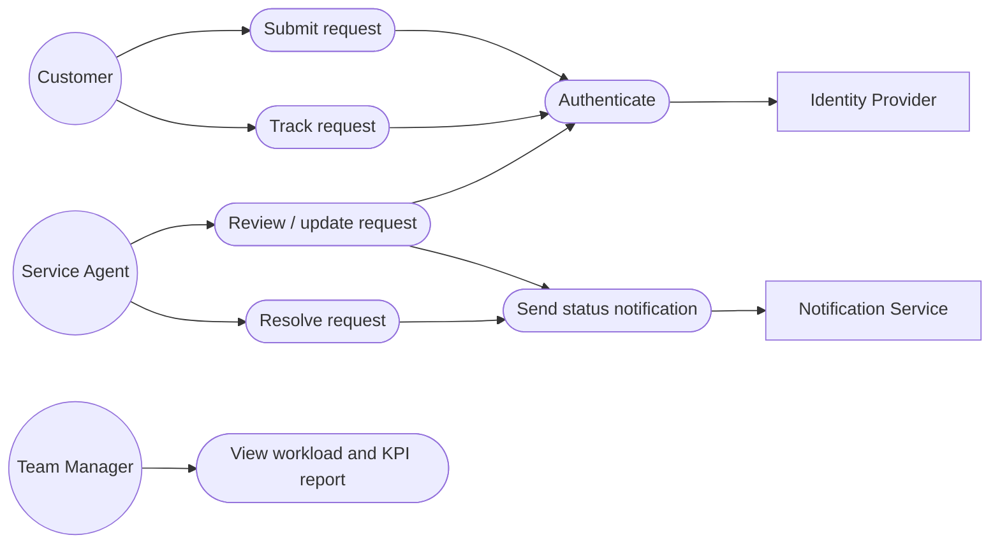
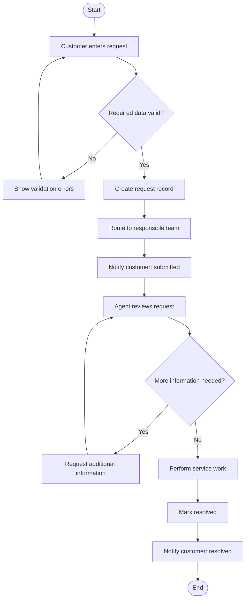
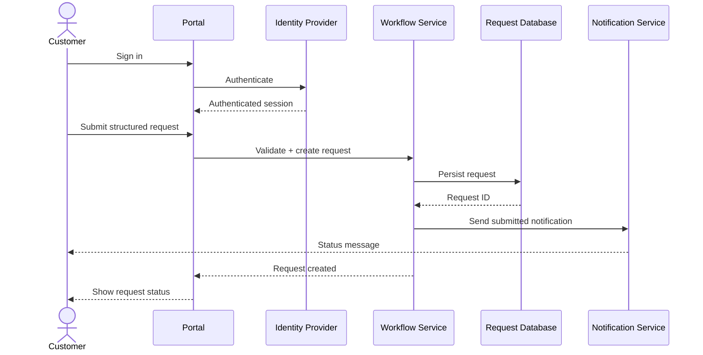
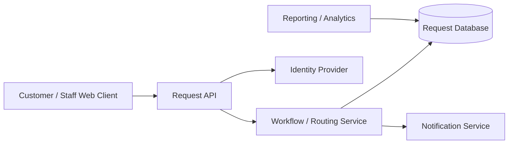

# Reconstructed UML-Style Diagrams

These diagrams were newly created for this public portfolio reconstruction; they are not claimed as original submitted coursework diagrams.

## Use-case view

## Activity view — request lifecycle

## Sequence view

## Component view

## Modelling observations

The diagrams separate user interaction, workflow responsibility, persistence, identity, notifications, and analytics. This separation makes it easier to reason about access control, system boundaries, ownership, failure points, and the data generated by the transformed process.
